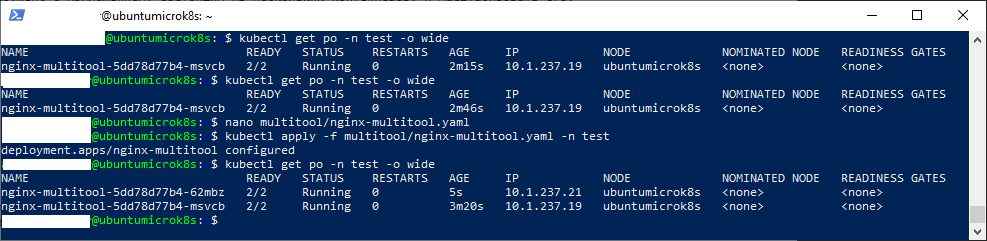
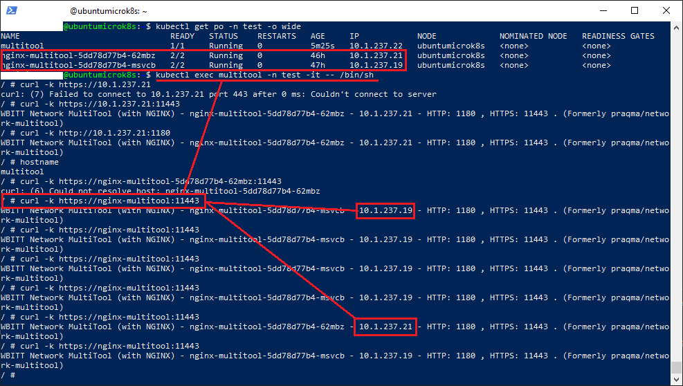
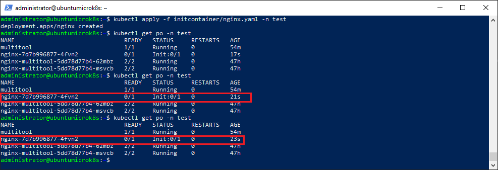
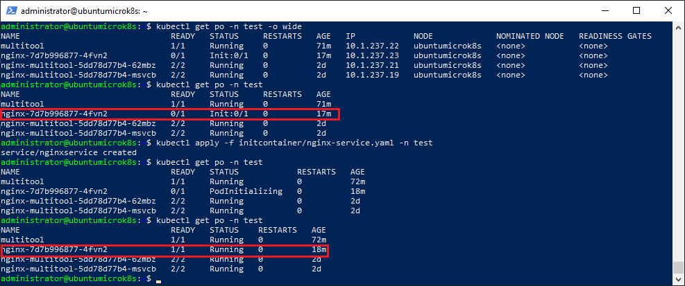

### Задание 1. Создать Deployment и обеспечить доступ к репликам приложения из другого Pod

1. Создать Deployment приложения, состоящего из двух контейнеров — nginx и multitool. Решить возникшую ошибку.
2. После запуска увеличить количество реплик работающего приложения до 2.
3. Продемонстрировать количество подов до и после масштабирования.
4. Создать Service, который обеспечит доступ до реплик приложений из п.1.
5. Создать отдельный Pod с приложением multitool и убедиться с помощью `curl`, что из пода есть доступ до приложений из п.1.

### Решение 1

1. Манифест развертывания nginx+multitool находится в [файле](manifests/nginx-multitool.yaml)
  Результат развертывания с *replicas=1* а затем *replicas=2*:
  
2. Манифест развертывания сервиса находится в [файле](manifests/nginx-multitool-service.yaml)
3. Манифест развертывания пода с образом multitool находится в [файле](manifests/multitool-pod.yaml)
4. Подключаемся к поду multitool командой:
   ```kubectl exec multitool -n test -it -- /bin/sh```
5. Проверяем что наш replicaset проводит балансировку нагрузки отправляя на общий адрес запросы:
   ```curl -k https://nginx-multitool:11443```
   Видим что ответ приходит с разных ip-адресов подов:
   

------

### Задание 2. Создать Deployment и обеспечить старт основного контейнера при выполнении условий

1. Создать Deployment приложения nginx и обеспечить старт контейнера только после того, как будет запущен сервис этого приложения.
2. Убедиться, что nginx не стартует. В качестве Init-контейнера взять busybox.
3. Создать и запустить Service. Убедиться, что Init запустился.
4. Продемонстрировать состояние пода до и после запуска сервиса.

### Решение 2

1. Манифест пода с *initContainer*, ожидающим появления сервиса nginxservice, находится в [файле](manifests/nginx.yaml) 
2. Разворачиваем под в пространстве *test* командой:
   ``` kubectl apply -f manifests/nginx.yaml -n test```
3. В результате под находится в состоянии ожидания:
   
4. Манифест сервиса находится в [файле](manifests/nginx-service.yaml)
5. Разворачиваем сервис в пространстве test командой:
   ``` kubectl apply -f manifests/nginx.yaml -n test```
   Видим изменение состояния пода:
   
   